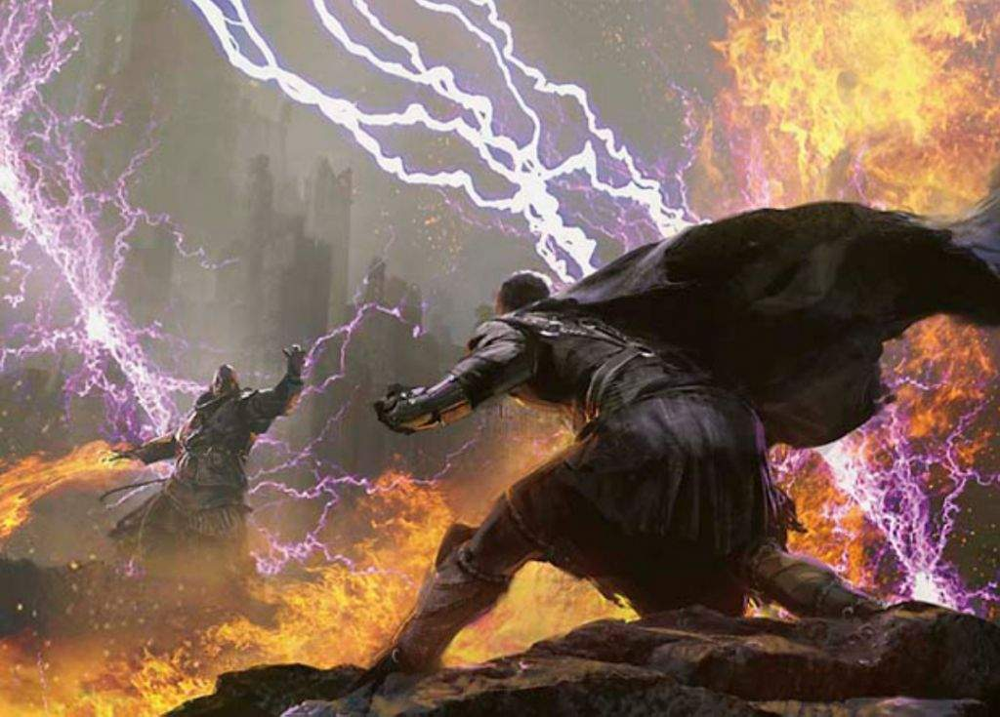

*"Arcane Melee", &copy;2013, Jaime Jones &commat; Wizards of the Coast*

# Homebrew Spells
> Mythril Forge Homebrew

Welcome to the Mythril Forge Homebrew!
This repo contains all sorts of info for 5th edition magic mods.
The data for these spells has been sourced from `5e.tools`.

## :chart_with_upwards_trend: Completion Status
This project's completion is sectioned off by each spell's level.
Each level is assigned a status, which contributes to the project's overall completion.
Here are the valid quality assurance statuses:
- :shit: entry is unacceptable (worse than before)
- :x: entry has not been modified
- :blossom: entry has been modified, but has not been reviewed for QA
- :star: personal QA pass validated on entry
- :star2: entry has been peer reviewed by at least 3 different people
- :stars: blogpost created on entry
- :white_flower: spell has been perfected/finalized

Here is the current status on each spell level:

#### Spell QA
| Spell Category | QA Mark   |
|:--------------:|:---------:|
| cantrips       | :star:    |
| level-1 spells | :blossom: |
| level-2 spells | :blossom: |
| level-3 spells | :blossom: |
| level-4 spells | :x:       |
| level-5 spells | :x:       |
| level-6 spells | :x:       |
| level-7 spells | :x:       |
| level-8 spells | :x:       |
| level-9 spells | :x:       |

# Markdown Rules
## Size Categories
Size categories are always written in italics as a mechanic indicator, like so: `*size*`. There are six size categories in total:
- *Tiny*
- *Small*
- *Medium*
- *Large*
- *Huge*
- *Gargantuan*

## Conditional Effects
**conditioned**

## Spell References
[*spell name*](./)

## Dice Rolls
### Regular Roll
…roll `??d??`…on a success…on a failure…

### Coin Flip
…flip `a coin`…on a heads…on a tails…

## Quoutes & Sidebars
> I like quotes.
> 
> &mdash;Jim Darkmagic

&hellip;more description text&hellip;

> Creator commentary & important rules

## Bulleted Lists
Some general instructions:
- A line item can be a full sentance.
- If a line item has multiple sentances, it must have a new line.
	The new line is always led by a tab (`\t`) character.
- Occasionally, an item will have further bullet notes itself:
	- It might look like this.
	- Or like this.
		A nested bullet can also have several sentances.
- And these sentances can always be escaped out one way or the other.

Bullets can occasionally take on one or two words (one preferred):
- ice
- fire
- water

You might notice that a bulleted list of any kind is always led by a sentance ending in a colon (`:`).
